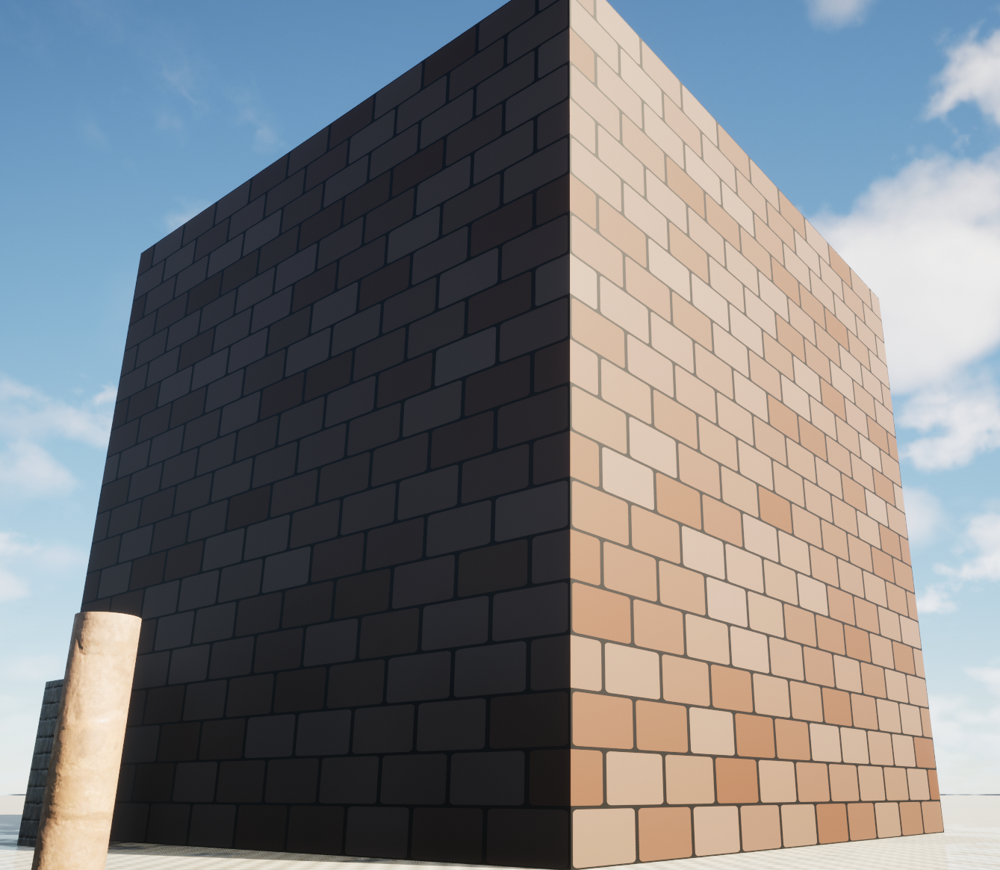
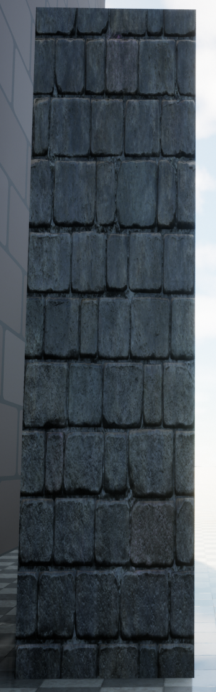
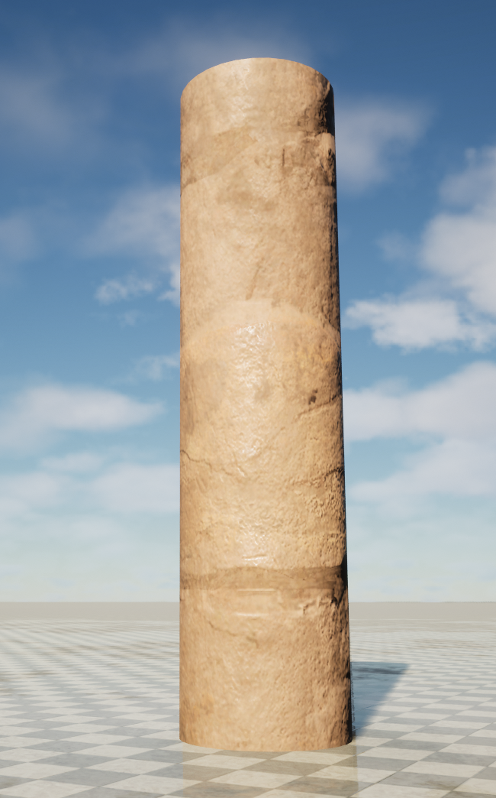

# Custom Scene Simulation Platform
This simulation platform introduces a **custom scene functionality** that enables users to define scene structure and behavioral logic through simple JSON files. The system automatically generates corresponding **static scenes, dynamic pedestrians, and physics simulation configurations**, achieving efficient and flexible testing and verification.

---

## 🌍 Feature Overview

By defining scene elements in JSON files, the platform automatically generates corresponding **Mujoco XML files** and constructs synchronized 3D simulation scenes in Unreal Engine (UE), achieving **unified visual and physical simulation**.

### Key Features

- **Static Scene Construction**  
  Build structures such as buildings, obstacles, and roads using variable-sized cube and cylinder elements.

- **Dynamic Pedestrian System**  
  - Support for multi-pedestrian parallel simulation  
  - Configurable walking speeds  
  - Custom polyline trajectory definition  
  - Automatic obstacle avoidance and path adjustment  

- **Terrain and Path Diversity**  
  Users can freely define terrain types, path layouts, pedestrian quantities, and distributions to rapidly simulate various real-world scenarios.

---

## 🧱 Supported Elements and Parameters

### Cube1

```json
{
  "Element1": {
    "name": "obstacle1",
    "type": "static",
    "model": "cube1",
    "position": {
      "x": 700,
      "y": 700,
      "z": 500
    },
    "rotation": {
      "pitch": 0,
      "yaw": 0,
      "roll": 0
    },
    "scale": {
      "x": 10,
      "y": 10,
      "z": 10
    }
  }
}
```

**Parameters:**
- `name`: Unique identifier for the element
- `type`: Element behavior type (`static` for fixed obstacles)
- `model`: Geometric shape (`cube1`)
- `position`: 3D coordinates in world space (x, y, z in cm)
- `rotation`: Euler angles (pitch, yaw, roll in degrees)
- `scale`: Size multipliers along each axis

<p align="center">
  
</p>

---

### Cube2

```json
{
  "Element2": {
    "name": "obstacle2",
    "type": "static",
    "model": "cube2",
    "position": {
      "x": 950,
      "y": 100,
      "z": 100
    },
    "rotation": {
      "pitch": 0,
      "yaw": 0,
      "roll": 0
    },
    "scale": {
      "x": 0.5,
      "y": 0.5,
      "z": 2
    }
  }
}
```

**Parameters:**
- `name`: Unique identifier for the element
- `type`: Element behavior type (`static` for fixed obstacles)
- `model`: Geometric shape (`cube2`)
- `position`: 3D coordinates in world space (x, y, z in cm)
- `rotation`: Euler angles (pitch, yaw, roll in degrees)
- `scale`: Size multipliers along each axis

<p align="center">
  
</p>

---

### Cylinder1

```json
{
  "Element3": {
    "name": "obstacle3",
    "type": "static",
    "model": "cylinder1",
    "position": {
      "x": 450,
      "y": -100,
      "z": 100
    },
    "rotation": {
      "pitch": 0,
      "yaw": 0,
      "roll": 0
    },
    "scale": {
      "x": 0.5,
      "y": 0.5,
      "z": 2
    }
  }
}
```

**Parameters:**
- `name`: Unique identifier for the element
- `type`: Element behavior type (`static` for fixed obstacles)
- `model`: Geometric shape (`cylinder1`)
- `position`: 3D coordinates in world space (x, y, z in cm)
- `rotation`: Euler angles (pitch, yaw, roll in degrees)
- `scale`: Size multipliers along each axis

<p align="center">
  
</p>

---

### Human1 (Dynamic Pedestrian)

```json
{
  "Element1": {
    "name": "pedestrian1",
    "type": "dynamic",
    "model": "human1",
    "avoid": true,
    "position": {
      "x": 1400,
      "y": 1200,
      "z": 90
    },
    "rotation": {
      "pitch": 0,
      "yaw": 0,
      "roll": 0
    },
    "scale": {
      "x": 1,
      "y": 1,
      "z": 1
    },
    "velocity": 0.3,
    "trajectory": {
      "point1": {
        "x": 1400,
        "y": -100,
        "z": 0
      },
      "point2": {
        "x": -1400,
        "y": -100,
        "z": 0
      }
    }
  }
}
```

**Parameters:**
- `name`: Unique identifier for the pedestrian
- `type`: Element behavior type (`dynamic` for moving entities)
- `model`: Character model (`human1`)
- `avoid`: Enable obstacle avoidance behavior (`true`/`false`)
- `position`: Initial spawn coordinates (x, y, z in cm)
- `rotation`: Initial orientation (pitch, yaw, roll in degrees)
- `scale`: Size multipliers along each axis
- `velocity`: Walking speed (meters per second)
- `trajectory`: Polyline path definition with waypoints (point1, point2, etc.)

<p align="center">
  
</p>

---

## 📋 Scene Definition Examples

### Example 1: Basic Pedestrian Movement

```json
{
  "Element1": {
    "name": "pedestrian1",
    "type": "dynamic",
    "model": "human1",
    "position": {
      "x": 2000,
      "y": 0,
      "z": 90
    },
    "rotation": {
      "pitch": 0,
      "yaw": 0,
      "roll": 0
    },
    "scale": {
      "x": 1,
      "y": 1,
      "z": 1
    },
    "velocity": 0.5,
    "trajectory": {
      "point1": {
        "x": -1000,
        "y": 0,
        "z": 0
      }
    }
  },
  "Element2": {
    "name": "pedestrian2",
    "type": "dynamic",
    "model": "human1",
    "position": {
      "x": 2000,
      "y": 500,
      "z": 90
    },
    "rotation": {
      "pitch": 0,
      "yaw": 180,
      "roll": 0
    },
    "scale": {
      "x": 1,
      "y": 1,
      "z": 1
    },
    "velocity": 0.5,
    "trajectory": {
      "point1": {
        "x": -1000,
        "y": 500,
        "z": 0
      }
    }
  },
  "Element3": {
    "name": "pedestrian3",
    "type": "dynamic",
    "model": "human1",
    "avoid": true,
    "position": {
      "x": 2000,
      "y": -500,
      "z": 90
    },
    "rotation": {
      "pitch": 0,
      "yaw": 90,
      "roll": 0
    },
    "scale": {
      "x": 1,
      "y": 1,
      "z": 1
    },
    "velocity": 0.5,
    "trajectory": {
      "point1": {
        "x": -1000,
        "y": -500,
        "z": 0
      }
    }
  }
}
```

<p align="center">
  
</p>

---

### Example 2: Pedestrians with Static Obstacles

```json
{
  "Element1": {
    "name": "pedestrian1",
    "type": "dynamic",
    "model": "human1",
    "avoid": true,
    "position": {
      "x": 2000,
      "y": 0,
      "z": 90
    },
    "rotation": {
      "pitch": 0,
      "yaw": 0,
      "roll": 0
    },
    "scale": {
      "x": 1,
      "y": 1,
      "z": 1
    },
    "velocity": 0.5,
    "trajectory": {
      "point1": {
        "x": -1000,
        "y": 0,
        "z": 0
      }
    }
  },
  "Element2": {
    "name": "pedestrian2",
    "type": "dynamic",
    "model": "human1",
    "avoid": true,
    "position": {
      "x": 2000,
      "y": 500,
      "z": 90
    },
    "rotation": {
      "pitch": 0,
      "yaw": 180,
      "roll": 0
    },
    "scale": {
      "x": 1,
      "y": 1,
      "z": 1
    },
    "velocity": 0.5,
    "trajectory": {
      "point1": {
        "x": -1000,
        "y": 500,
        "z": 0
      }
    }
  },
  "Element3": {
    "name": "pedestrian3",
    "type": "dynamic",
    "model": "human1",
    "avoid": true,
    "position": {
      "x": 2000,
      "y": -500,
      "z": 90
    },
    "rotation": {
      "pitch": 0,
      "yaw": 90,
      "roll": 0
    },
    "scale": {
      "x": 1,
      "y": 1,
      "z": 1
    },
    "velocity": 0.5,
    "trajectory": {
      "point1": {
        "x": -1000,
        "y": -500,
        "z": 0
      }
    }
  },
  "Element4": {
    "name": "obstacle1",
    "type": "static",
    "model": "cube1",
    "position": {
      "x": 1000,
      "y": 600,
      "z": 50
    },
    "rotation": {
      "pitch": 0,
      "yaw": 0,
      "roll": 0
    },
    "scale": {
      "x": 1,
      "y": 1,
      "z": 1
    }
  },
  "Element5": {
    "name": "obstacle2",
    "type": "static",
    "model": "cube2",
    "position": {
      "x": 1000,
      "y": -600,
      "z": 50
    },
    "rotation": {
      "pitch": 0,
      "yaw": 0,
      "roll": 0
    },
    "scale": {
      "x": 1,
      "y": 1,
      "z": 1
    }
  }
}
```

<p align="center">
  
</p>

---

### Example 3: Complex Scene with Multiple Obstacles

```json
{
  "Element1": {
    "name": "pedestrian1",
    "type": "dynamic",
    "model": "human1",
    "avoid": true,
    "position": {
      "x": 1400,
      "y": 1200,
      "z": 90
    },
    "rotation": {
      "pitch": 0,
      "yaw": 0,
      "roll": 0
    },
    "scale": {
      "x": 1,
      "y": 1,
      "z": 1
    },
    "velocity": 0.3,
    "trajectory": {
      "point1": {
        "x": 1400,
        "y": -100,
        "z": 0
      },
      "point2": {
        "x": -1400,
        "y": -100,
        "z": 0
      }
    }
  },
  "Element2": {
    "name": "pedestrian2",
    "type": "dynamic",
    "model": "human1",
    "avoid": true,
    "position": {
      "x": 1300,
      "y": 1200,
      "z": 90
    },
    "rotation": {
      "pitch": 0,
      "yaw": 180,
      "roll": 0
    },
    "scale": {
      "x": 1,
      "y": 1,
      "z": 1
    },
    "velocity": 0.25,
    "trajectory": {
      "point1": {
        "x": 1300,
        "y": 100,
        "z": 0
      },
      "point2": {
        "x": -1300,
        "y": 100,
        "z": 0
      }
    }
  },
  "Element3": {
    "name": "obstacle1",
    "type": "static",
    "model": "cube1",
    "position": {
      "x": 700,
      "y": 700,
      "z": 500
    },
    "rotation": {
      "pitch": 0,
      "yaw": 0,
      "roll": 0
    },
    "scale": {
      "x": 10,
      "y": 10,
      "z": 10
    }
  },
  "Element4": {
    "name": "obstacle2",
    "type": "static",
    "model": "cube2",
    "position": {
      "x": 950,
      "y": 100,
      "z": 100
    },
    "rotation": {
      "pitch": 0,
      "yaw": 0,
      "roll": 0
    },
    "scale": {
      "x": 0.5,
      "y": 0.5,
      "z": 2
    }
  },
  "Element5": {
    "name": "obstacle3",
    "type": "static",
    "model": "cylinder1",
    "position": {
      "x": 450,
      "y": -100,
      "z": 100
    },
    "rotation": {
      "pitch": 0,
      "yaw": 0,
      "roll": 0
    },
    "scale": {
      "x": 0.5,
      "y": 0.5,
      "z": 2
    }
  },
  "Element6": {
    "name": "obstacle4",
    "type": "static",
    "model": "cube2",
    "position": {
      "x": 1400,
      "y": 900,
      "z": 100
    },
    "rotation": {
      "pitch": 0,
      "yaw": 0,
      "roll": 0
    },
    "scale": {
      "x": 0.5,
      "y": 0.5,
      "z": 2
    }
  }
}
```

<p align="center">
  
</p>

---

## ⚙️ Automatic Conversion and Synchronization

The platform automatically:
- Parses JSON files and generates Mujoco XML configurations
- Synchronizes UE scenes with Mujoco physics engine
- Ensures visual models align with physics collision bodies for accurate simulation

---

## 🚶‍♂️ Application Scenarios

- **Pedestrian Avoidance Algorithm Verification**  
  Test intelligent agent obstacle avoidance behaviors in controlled environments

- **Multi-Agent Path Planning**  
  Evaluate coordination strategies for multiple autonomous agents

- **Urban Traffic and Crowd Simulation**  
  Model realistic pedestrian flow patterns in city scenarios

- **Robot Navigation Testing**  
  Verify navigation algorithms across diverse terrain conditions

- **Pedestrian Detection and Prediction**  
  Assess performance of detection and trajectory prediction models

---

## 🚀 Key Advantages

- **Rapid Modeling**  
  Define complex scenes using simple JSON without manual construction

- **Flexible Extension**  
  Support for multiple geometric primitives and terrain types with easy extensibility

- **Efficient Verification**  
  Quickly switch between scene configurations to test algorithm robustness and generalization

- **Physics Consistency**  
  Synchronized UE visual scenes and Mujoco physics engine ensure simulation accuracy

---

## 📄 Summary

The custom scene functionality enables users to build diverse simulation environments with minimal effort. Through the automated JSON → XML → UE conversion pipeline, it achieves seamless integration from structural definition to physics simulation, providing an efficient and scalable experimental platform for algorithm development and testing.