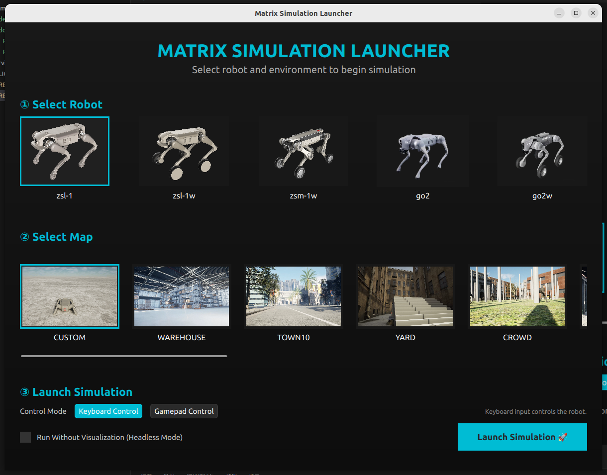
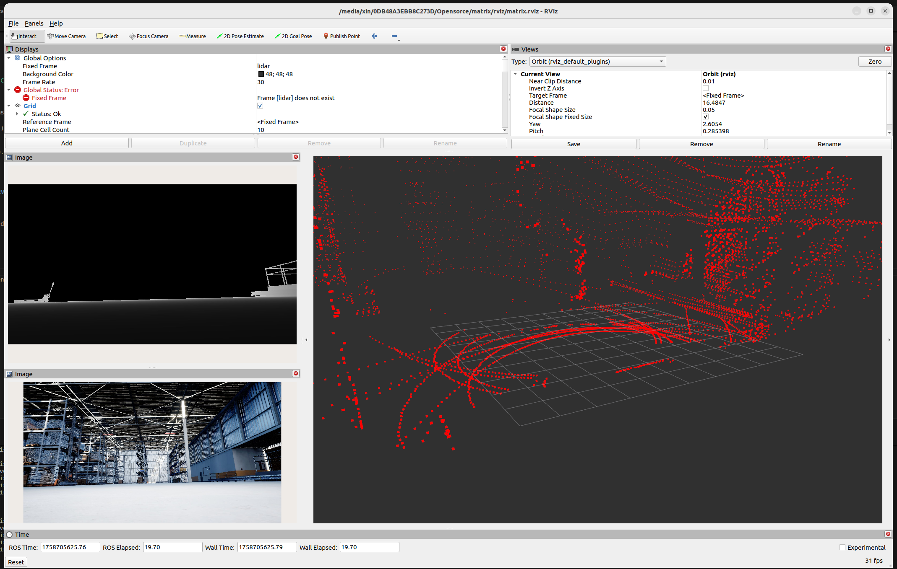

# MATRiX

<div align="center">
  <a href="#">
    
  </a>
</div>

<div align="center">

[](../README.md)
[](README_CN.md)

</div>

> **最后更新：** 2026-01-06

MATRiX 是一个集成了 **MuJoCo**、**Unreal Engine 5** 和 **CARLA** 的高级仿真平台，提供用于四足机器人研究的高保真、交互式环境。其软件在环（software-in-the-loop）架构支持真实物理仿真、沉浸式视觉效果，并优化了仿真到现实的迁移（sim-to-real）以便机器人开发与部署。

## 💬 交流社区

**加入我们的微信群,参与 MATRiX 仿真交流:**

<div align="center">
  
  <p><em>扫码加入 MATRiX 仿真交流群</em></p>
</div>

---

## 📂 目录结构

```text
matrix/
├── bin/                         # 可执行二进制文件 (构建后生成)
├── config/                      # 配置文件
│   └── config.json              # 核心传感器和系统设置
├── demo_gif/                    # 用于文档展示的演示动图
│   ├── Maps/                    # 不同地图的预览图像
│   ├── Robot/                   # 支持机器人的预览图像
│   └── Scene/                   # 自定义场景设置的演示
├── deps/                        # 第三方依赖 (.deb 软件包)
│   ├── ecal_*.deb               # eCAL 通信库
│   ├── mujoco_*.deb             # MuJoCo 仿真引擎
│   └── ...                      # 其他必要依赖
├── docs/                        # 项目文档
│   ├── README_CN.md             # README 中文版
│   ├── CHUNK_PACKAGES_GUIDE.md  # 分块包使用指南
│   └── ...                      # 开发和维护指南
├── dynamicmaps/                 # 动态地图资源
├── releases/                    # 下载的分块包存储位置
│   ├── assets-*.tar.gz          # 资源文件包 (必需) - 二进制文件、模型、库
│   ├── base-*.tar.gz            # 基础包 (必需) - 核心文件和 EmptyWorld 地图
│   ├── shared-*.tar.gz          # 共享资源 (推荐) - 多个地图共享的资源
│   ├── *-*.tar.gz               # 地图包 (可选) - 各个地图数据
│   └── manifest-*.json          # 包版本清单
├── rviz/                        # ROS 可视化 (RViz) 配置
│   └── matrix.rviz              # 预配置的 RViz 布局
├── scene/                       # 自定义场景描述文件 (JSON)
│   ├── scene.json               # 当前活动的场景配置
│   └── scene_example_*.json     # 自定义场景模板
├── scripts/                     # 实用工具和构建脚本
│   ├── build.sh                 # 一键构建和设置 (入口点)
│   ├── run_sim.sh               # 仿真启动脚本 (CLI)
│   ├── install_deps.sh          # 依赖安装工具
│   └── release_manager/         # 发布和包管理工具
├── src/                         # 源代码
│   ├── robot_mc/                # 运动控制核心逻辑
│   ├── robot_mujoco/            # MuJoCo 仿真接口
│   └── UeSim/                   # Unreal Engine 高保真接口
├── LICENSE                      # 项目许可证
└── README.md                    # 项目文档 (英文版)
```

---

## ⚙️ 环境依赖

- **操作系统：** Ubuntu 22.04
- **推荐 GPU：** NVIDIA RTX 4060 或更高 (**建议 NVIDIA 驱动 >= 535**)
- **Unreal Engine：** 已集成（无需单独安装）
- **构建环境：**
  - GCC/G++ ≥ C++11
  - CMake ≥ 3.16
- **MuJoCo：** 3.3.0 开源版本（已集成）
- **遥控器：** 必需（推荐：*Logitech Wireless Gamepad F710*）
- **Python 依赖：** `gdown`（用于从 Google Drive 下载分块包）
- **ROS 依赖：** `ROS_humble`

---

## 🚀 安装与构建

1. **LCM 安装**
   ```bash
   sudo apt update
   sudo apt install -y cmake-qt-gui gcc g++ libglib2.0-dev python3-pip
   ```
   从 [LCM Releases](https://github.com/lcm-proj/lcm/releases) 下载源码并解压。

   构建并安装：
   ```bash
   cd lcm-<version>
   mkdir build
   cd build
   cmake ..
   make -j$(nproc)
   sudo make install
   ```
   > **注意：** 将 `<version>` 替换为实际解压出的 LCM 目录名。

2. **克隆 MATRiX 仓库**
   ```bash
   git clone https://github.com/zsibot/matrix.git
   cd matrix
   ```

3. **安装依赖**
   ```bash
   ./scripts/build.sh
   ```
   *(该脚本将自动安装所有所需依赖)*

4. **安装分块包（模块化安装）**

   MATRiX 使用模块化分块包系统，允许您只下载所需内容：

   - **资源文件包 (Assets Package)**（必需）：运行时二进制文件、共享库、ONNX 模型、3D 模型等必需文件
   - **基础包 (Base Package)**（必需）：核心文件和 EmptyWorld 地图
   - **共享资源 (Shared Resources)**（推荐）：多个地图共享的资源
   - **地图包 (Map Packages)**（可选）：可按需下载的各个地图

   **快速安装：**

   ```bash
   bash scripts/release_manager/install_chunks.sh 0.1.1
   ```

   > 📖 **详细说明：** 有关分块包系统的完整说明、包大小、地图列表、验证安装和常见问题，请参阅 [Chunk Packages 使用指南](CHUNK_PACKAGES_GUIDE.md)。

   **备选方案：手动安装（通过云存储）**

   如果无法顺畅访问 GitHub，请按照以下步骤手动安装：

   1. **下载** 资源包：
      - **Google Drive**: [下载链接](https://drive.google.com/file/d/1e_WjFg_MJgF4X-tqR9KyjC7h1rQiMQqN/view?usp=sharing)
      - **百度网盘**: [下载链接](https://pan.baidu.com/s/1o-7lICRBvshj--zq3OBTNA?pwd=nwjy)
   2. **解压** 所有 `.tar.gz` 和 `.json` 文件至 `matrix/releases/` 目录。
   3. **安装** 使用本地脚本：
      ```bash
      bash scripts/release_manager/install_chunks_local.sh 0.1.1
      ```

      > ⚠️ **重要提示：** 在运行安装脚本之前，请确保所有分块文件（base, assets, shared 等）已直接放置在 `matrix/releases/` 目录下。

---

## ▶️ 运行仿真

<div align="center">
  
</div>

## 🐕 仿真设置指南

1. **运行启动器**
   ```bash
   cd matrix
   ./bin/sim_launcher
   ```
2. **选择机器人类型**
   选择用于仿真的四足机器人类型。

3. **选择环境**
   选择所需的仿真环境或地图。

4. **选择控制设备**
   选择首选控制设备：
   - **手柄控制 (Gamepad Control)**
   - **键盘控制 (Keyboard Control)**

5. **启用无界面模式（可选）**
   切换 **Headless Mode** 以在无图形界面的情况下运行仿真。

6. **启动仿真**
   点击 **Launch Simulation** 按钮以开始仿真。

仿真运行期间，如果 UE 窗口处于激活状态，可按 **ALT + TAB** 切换出窗口。
然后使用启动器上的控制模式切换按钮随时在手柄和键盘控制之间切换。

## 🎮 遥控器说明（手柄控制指南）

| 操作 | 控制输入 |
|------|---------|
| 站立 / 坐下 | 按住 **LB** + **Y** |
| 前进 / 后退 / 左移 / 右移 | **左摇杆** (上 / 下 / 左 / 右) |
| 向左 / 向右旋转 | **右摇杆** (左 / 右) |
| 向前跳 (冲刺) | 按住 **RB** + **Y** |
| 原地跳 | 按住 **RB** + **X** |
| 翻筋斗 | 按住 **RB** + **B** |


## ⌨️ 遥控器说明（键盘控制指南）

| 操作 | 控制输入 |
|------|---------|
| 站立 | U |
| 坐下 | 空格键 (Space) |
| 前进 / 后退 / 左移 / 右移 | W / S / A / D |
| 向左 / 向右旋转 | Q / E |
| 开始 | Enter |

按 **V** 键在自由相机与机器人视角之间切换。

按住 **鼠标左键** 可临时切换到自由相机模式。

---

## 🏞️ 演示场景

<div align="center">

| **地图** | **演示截图** | **地图** | **演示截图** |
|:-------:|:----------:|:-------:|:----------:|
| **Venice** |  | **Warehouse** |  |
| **Town10** |  | **Yard** |  |

</div>

> **注意：** [地图描述](README_1.md)。

> **注意：** 上述截图展示了用于机器人和强化学习实验的高保真 UE5 渲染效果。

---

## 🛠️ 脚本使用指南

MATRiX 提供了多种脚本来帮助您构建、安装和运行仿真器。以下是如何有效使用它们：

### 📋 脚本分类

#### **用户脚本**（面向最终用户）

| 脚本 | 用途 | 使用方法 |
|------|------|---------|
| `build.sh` | 一键构建和依赖安装 | `./scripts/build.sh` |
| `run_sim.sh` | 启动仿真 | `./scripts/run_sim.sh <机器人类型> <地图ID>` |
| `install_chunks.sh` | 从 GitHub Releases 下载并安装分块包 | `bash scripts/release_manager/install_chunks.sh <版本>` |
| `install_chunks_local.sh` | 从本地 releases/ 目录安装分块包 | `bash scripts/release_manager/install_chunks_local.sh <版本>` |

#### **开发者脚本**（面向贡献者）

| 脚本 | 用途 | 使用方法 |
|------|------|---------|
| `build_mc.sh` | 构建 MC 控制模块 | `./scripts/build_mc.sh` |
| `upload_to_release.sh` | 上传包到 GitHub Releases（包含自动一致性检查和发布功能） | `bash scripts/release_manager/upload_to_release.sh <版本>` |
| `split_large_files.sh` | 分割大文件 (>2GB) 用于 GitHub | `bash scripts/release_manager/split_large_files.sh <文件路径>` |

#### **离线安装（无网络）**

```bash
# 1. 在有网络的机器上，下载包
bash scripts/release_manager/install_chunks.sh 0.1.1

# 2. 将 releases/ 目录复制到离线机器

# 3. 在离线机器上，从本地文件安装
bash scripts/release_manager/install_chunks_local.sh 0.1.1
# → 安装资源文件包（必需）和 releases/ 目录中的所有其他包
```

#### **稍后添加更多地图**

```bash
# 选项 1: 下载并安装新地图
bash scripts/release_manager/install_chunks.sh 0.1.1
# → 选择要下载的额外地图

# 选项 2: 如果文件已在 releases/ 中，直接安装
bash scripts/release_manager/install_chunks_local.sh 0.1.1
# → 安装资源文件包（如需要）和 releases/ 中的所有可用地图
```

#### **重新安装包**

```bash
# 从本地 releases/ 目录快速重新安装
bash scripts/release_manager/install_chunks_local.sh 0.1.1
# → 无需下载，快速安装
```

### 💡 脚本选择指南

**何时使用 `install_chunks.sh`：**
- ✅ 首次安装
- ✅ 需要从 GitHub 下载最新版本
- ✅ 希望选择性选择要下载的地图
- ✅ 有网络连接

**何时使用 `install_chunks_local.sh`：**
- ✅ 文件已下载到 `releases/` 目录
- ✅ 离线安装（无网络）
- ✅ 快速重新安装现有包
- ✅ 希望自动安装所有可用地图

### 📁 理解文件位置

```text
matrix/
├── releases/                    # 下载的包（运行 install_chunks.sh 后创建）
│   ├── assets-0.1.1.tar.gz     # 资源文件包（必需）
│   ├── base-0.1.1.tar.gz       # 基础包（必需）
│   ├── shared-0.1.1.tar.gz     # 共享资源（推荐）
│   └── *.tar.gz                # 地图包（可选）
│
└── src/UeSim/Linux/zsibot_mujoco_ue/  # 运行时目录（包安装位置）
    └── Content/Paks/            # 已安装的分块文件 (.pak, .ucas, .utoc)
```

**关键点：**
- `matrix/releases/` = 下载包的存储位置（源文件）
- `src/UeSim/Linux/zsibot_mujoco_ue/Content/Paks/` = 运行时位置（已安装文件）
- `install_chunks.sh` 下载到 `matrix/releases/` 并安装到运行时目录
- `install_chunks_local.sh` 仅从 `matrix/releases/` 安装到运行时目录

> **提示：** 保留 `matrix/releases/` 目录中的文件以供将来使用。您可以删除它们以节省空间，但如果要重新安装，则需要重新下载。

---

## 🗺️ 地图 ID 参考

使用 `run_sim.sh` 时，可以通过 ID 指定地图：

| 地图 ID | 地图名称 | 说明 |
|--------|----------|------|
| 0 | CustomWorld | 自定义地图 |
| 1 | Warehouse | 仓库环境 |
| 2 | Town10World | Town10 地图 |
| 3 | YardWorld | 庭院环境 |
| 4 | CrowdWorld | 人群仿真 |
| 5 | VeniceWorld | 威尼斯地图 |
| 6 | HouseWorld | 房屋环境 |
| 7 | RunningWorld | 跑步赛道 |
| 8 | Town10Zombie | 带僵尸的 Town10 |
| 9 | IROSFlatWorld | IROS 平坦地形 |
| 10 | IROSSlopedWorld | IROS 斜坡地形 |
| 11 | IROSFlatWorld2025 | IROS 平坦地形 2025 |
| 12 | IROSSloppedWorld2025 | IROS 斜坡地形 2025 |
| 13 | OfficeWorld | 办公室环境 |
| 14 | 3DGSWorld | 3D 高斯地图 |
| 15 | MoonWorld | 月球环境 |

**使用示例：**
```bash
./scripts/run_sim.sh 1 1   # XGB 机器人，Warehouse 地图
./scripts/run_sim.sh 4 4   # GO2 机器人，CrowdWorld 地图
./scripts/run_sim.sh 1 0   # XGB 机器人，CustomWorld 地图
```

---

## 🔧 配置指南

### 自定义场景设置
- 按照 `matrix/scene/` 中的现有格式，在 json 文件中编写您的自定义场景，详细信息请参阅 [教程文档](README_2.md)。
- 将您的自定义场景文件放在 `matrix/scene/scene.json` 文件中。
- 从启动器中选择自定义地图以在仿真中加载它。

### 调整传感器配置

编辑：
```bash
vim matrix/config/config.json
```

示例片段：
```json
"sensors": {
  "camera": {
    "position": { "x": 29.0, "y": 0.0, "z": 1.0 },
    "rotation": { "roll": 0.0, "pitch": 15.0, "yaw": 0.0 },
    "height": 1080,
    "width": 1920,
    "sensor_type": "rgb",
    "topic": "/image_raw/compressed"
  },
  "depth_sensor": {
    "position": { "x": 29.0, "y": 0.0, "z": 1.0 },
    "rotation": { "roll": 0.0, "pitch": 15.0, "yaw": 0.0 },
    "height": 480,
    "width": 640,
    "sensor_type": "depth",
    "topic": "/image_raw/compressed/depth"
  },
  "lidar": {
    "position": { "x": 13.011, "y": 2.329, "z": 17.598 },
    "rotation": { "roll": 0.0, "pitch": 0.0, "yaw": 0.0 },
    "sensor_type": "mid360",
    "topic": "/livox/lidar"
  }
}
```

- 根据需要调整 **位置 (pose)** 和 **传感器数量**
- 删除未使用的传感器以提升 **UE 帧率 (FPS)**

---

## 📡 传感器数据后处理

- 深度相机输出的图像为 `sensor_msgs::msg::Image`，编码为 **32FC1**。
- 获取灰度深度图像的示例代码：

```cpp
void callback(const sensor_msgs::msg::Image::SharedPtr msg)
{
  cv::Mat depth_image;
  depth_image = cv::Mat(HEIGHT, WIDTH, CV_32FC1, const_cast<uchar*>(msg->data.data()));
}
```

---

## 📡 在 RViz 中可视化传感器数据

要在 RViz 中可视化传感器数据：

1. **启动仿真**（如上所述）。
2. **启动 RViz**：
   ```bash
   rviz2
   ```
3. **加载配置**：
   在 RViz 中打开 `rviz/matrix.rviz`，该文件提供预配置视图。

<div align="center">
  
</div>

> **提示：** 确保已正确 source ROS 环境并且相关话题已被发布。

## 📋 待办事项 (TODO List)

- [x] IROS 比赛地图 (4 张地图)
- [x] 支持第三方四足机器人模型
- [x] 支持基于 json 文件的自定义场景
- [x] 添加 3DGS 重建地图
- [x] 添加基于动态地面的月球地图
- [ ] 添加多机器人仿真能力

---
## 🙏 致谢

本项目基于以下开源项目的出色工作构建：

- [MuJoCo-Unreal-Engine-Plugin](https://github.com/oneclicklabs/MuJoCo-Unreal-Engine-Plugin)
- [MuJoCo](https://github.com/google-deepmind/mujoco)
- [Unreal Engine](https://github.com/EpicGames/UnrealEngine)
- [CARLA](https://carla.org/)

我们感谢这些项目的开发者和贡献者，他们为推进机器人与仿真技术提供了宝贵支持。

---

## 📚 文档

- [English Documentation](../README.md) - 英文使用指南
- [Chunk Packages 使用指南](CHUNK_PACKAGES_GUIDE_CN.md) - 模块化打包部署说明
- [机器人类型与地图选择](README_1_CN.md) - 详细的机器人类型和地图说明（含图片）
- [自定义场景指南](README_2_CN.md) - 通过 JSON 文件创建自定义场景

---
